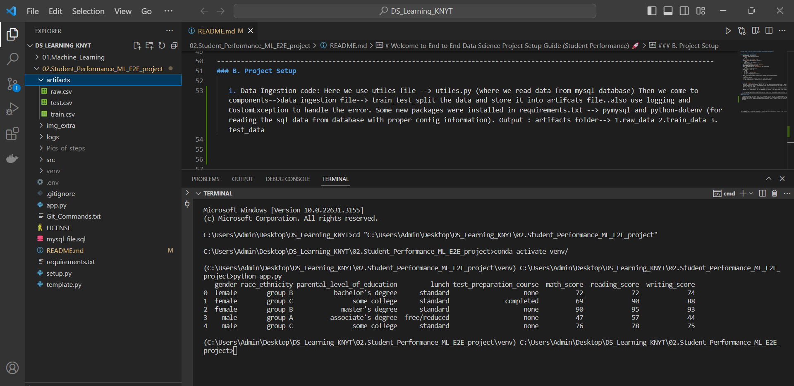
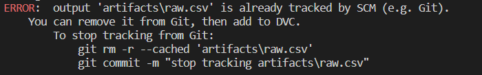
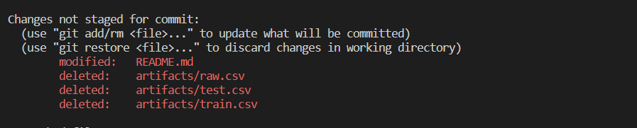

# Welcome to End to End Data Science Project Setup Guide (Student Performance) 🚀


### A. Git and Github Repository Setup

   1. Make README.md, requirements.txt
   2. Initialize the Git Repo in this Folder. 
        ```bash
        git init 
        ```
   3. Add `.gitignore` and `LICENSE` files.
   4. Create a Virtual Environment and activate it.
        ```bash
        conda create -p venv python==3.9 -y
        conda activate venv/
        ```
   5. Add virtual environment (`venv/`) to `.gitignore`.
   6. Update README.md with project details.
   7. Write required packages in `requirements.txt` and install them.
        ```bash
        pip install -r requirements.txt
        ```
   8. Push changes to Github Repo.
        ```bash
        git add .
        git commit -m "Initial commit"
        git remote add origin <repository_url>
        git push -u origin master
        ``
   9. After installing requirements.txt also install ipykernel (to use jupyter notebook).
       ```bash
       pip install ipykernel
       ```
     (if while using ipynb --> importing pandas says --> To install Pyarrow 
      --> then install it also in terminal using --> pip install Pyarrow)


   
   10. Creating `setup.py` and add `-e .` into requirements.txt
      ```
      This setup.py file is very important , because this will make the Folder/application as package...and we can even push it to PyPi and anyone can use it as package.Here we can add various informations about the package also who created it,on which date and so many things.
      ```
      Now , Once we have -e . in requirements.txt --> do pip install -r requirements.txt --> this will create
     the dir as package.

      Best way --> To comment down -e . for now and make the dir a package at the end of the end to end project...
       

   11. Creating logger.py and exception.py and calling these to app.py and run app.py as oue application and gets the logs.
       
-----------------------------------------------------------------------------------------------------------------------------
### B. Project Setup

1. Data Ingestion code: Here we use utiles file --> utiles.py (where we read data from mysql database) Then we come to components-->data_ingestion file--> train_test_split the data and store it into artifcats file..also use logging and CustomException to handle the error. Some new packages were installed in requirements.txt --> pymysql and python-dotenv (for reading the sql data from database with proper config information). Output : artifacts folder--> 1.raw_data 2.train_data 3.test_dat


2. We will track the data using dvc just like we track code using git

dvc: data version control
What is DVC? Data Version Control is a free, open-source tool for data management,
ML pipeline automation, and experiment management. This helps data science and 
machine learning teams manage large datasets, make projects reproducible, and collaborate better.


Why we are not supposed to use git to track the data?
While Git is excellent for versioning code and text-based files, DVC extends version control capabilities to data, making it the preferred choice for managing data in machine learning projects.
    
AIM : IS TO TRACK THE artifacts folder's data....
(Because if new dataset comes then we need to understand that where we need to retrain and all)

  
-> step1: dvc init --> this will make two things... (a) .dvc (folder)  (b) .dvcignore
(We are not suppose to commit this .dvc in github)
(And in this .dvc --> entire tracking of data will be there.)
     
-> step2: bash '''dvc add artifacts/raw.csv'''
(We will  get error like ,because we were already tracking the artifacts using git and now we were trying to track it using dvc)



-> step3: Since we want to track artifacts folder and its data using dvc , for that we need to untrack the artifacts from git.....

( SO delete the folder artifacts direclty and push the change to git now...without artifacts )


Since it got untracked from git...
now if we do...
"""python app.py""" --> this will again make the artifacts folder but this time it is not being tracked by git...and now if we do 
    
Now do this in terminal...
git rm -r --cached "artifacts\raw.csv"
git commit -m "Stop tracking artifacts\raw.csv"


then 
dvc add artifacts\raw.csv

then
git add .gitignore         # Ensure .gitignore is updated if needed
    
 git commit -m "Add raw.csv to DVC"


Then no issue will be there...and a new file would be added in artifacts.

3. Data transformation code:

This setup guide aims to streamline the process of initializing a data science project, ensuring proper version control with Git, and maintaining a clean project structure. Happy coding! 🎉
