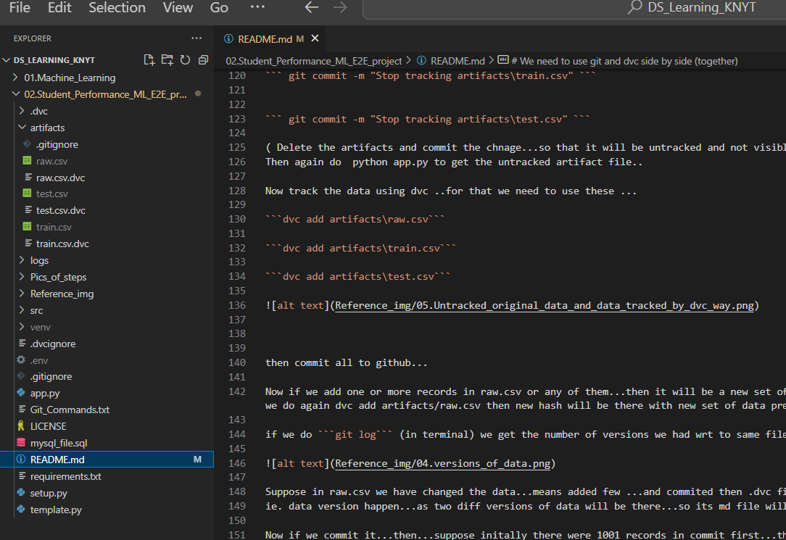

# Welcome to End to End Data Science Project Setup Guide (Student Performance) 🚀


### A. Git and Github Repository Setup

   1. Make README.md, requirements.txt
   2. Initialize the Git Repo in this Folder. 
        ```bash
        git init 
        ```
   3. Add `.gitignore` and `LICENSE` files.
   4. Create a Virtual Environment and activate it.
        ```bash
        conda create -p venv python==3.9 -y
        conda activate venv/
        ```
   5. Add virtual environment (`venv/`) to `.gitignore`.
   6. Update README.md with project details.
   7. Write required packages in `requirements.txt` and install them.
        ```bash
        pip install -r requirements.txt
        ```
   8. Push changes to Github Repo.
        ```bash
        git add .
        git commit -m "Initial commit"
        git remote add origin <repository_url>
        git push -u origin master
        ``
   9. After installing requirements.txt also install ipykernel (to use jupyter notebook).
       ```bash
       pip install ipykernel
       ```
     (if while using ipynb --> importing pandas says --> To install Pyarrow 
      --> then install it also in terminal using --> pip install Pyarrow)


   
   10. Creating `setup.py` and add `-e .` into requirements.txt
      ```
      This setup.py file is very important , because this will make the Folder/application as package...and we can even push it to PyPi and anyone can use it as package.Here we can add various informations about the package also who created it,on which date and so many things.
      ```
      Now , Once we have -e . in requirements.txt --> do pip install -r requirements.txt --> this will create
     the dir as package.

      Best way --> To comment down -e . for now and make the dir a package at the end of the end to end project...
       

   11. Creating logger.py and exception.py and calling these to app.py and run app.py as oue application and gets the logs.
       
-----------------------------------------------------------------------------------------------------------------------------
### B. Project Setup

1. Data Ingestion code: Here we use utiles file --> utiles.py (where we read data from mysql database) Then we come to components-->data_ingestion file--> train_test_split the data and store it into artifcats file..also use logging and CustomException to handle the error. Some new packages were installed in requirements.txt --> pymysql and python-dotenv (for reading the sql data from database with proper config information). Output : artifacts folder--> 1.raw_data 2.train_data 3.test_data


-------------------------------------------------------------------------------------------------------------------------------------------------------

2. We will track the data using dvc just like we track code using git

dvc: data version control
What is DVC? Data Version Control is a free, open-source tool for data management,
ML pipeline automation, and experiment management. This helps data science and 
machine learning teams manage large datasets, make projects reproducible, and collaborate better.


Why we are not supposed to use git to track the data?
While Git is excellent for versioning code and text-based files, DVC extends version control capabilities to data, making it the preferred choice for managing data in machine learning projects.
    
 ----------------------------------------------------------------------------------------------------------------------   
# We need to use git and dvc side by side (together)

AIM : IS TO TRACK THE artifacts folder's data....
(Because if new dataset comes then we need to understand that where we need to retrain and all)

pip install dvc (in terminal)


-> step0 : git init
-> step1: dvc init  --> this will make two things... (a) .dvc (folder)  (b) .dvcignore
(We are not suppose to commit this .dvc in github)
(And in this .dvc --> entire tracking of data will be there.)
(Make sure that before dvc init we have done git init ..if it was throughing error of being repo untracked)
(.dvc--> we should have config, .gitignore (vimp) and tmp)


summary: 
* git init
* dvc init
* git add .
* git status
* git commit -m "dvc init"
* dvc add artifacts/raw.csv     ---> this will through error so...

ERROR:  output 'artifacts\raw.csv' is already tracked by SCM (e.g. Git).                                                                                                  
    You can remove it from Git, then add to DVC.
        To stop tracking from Git:
            git rm -r --cached 'artifacts\raw.csv'
            git commit -m "stop tracking artifacts\raw.csv"


Since we want to track artifacts folder and its data using dvc , for that we need to untrack the artifacts from git

Now do this in terminal...

``` git rm -r --cached "artifacts\raw.csv" ```

``` git rm -r --cached "artifacts\train.csv" ```

``` git rm -r --cached "artifacts\test.csv" ```

do it for all raw,train and test...

``` git commit -m "Stop tracking artifacts\raw.csv" ```


``` git commit -m "Stop tracking artifacts\train.csv" ```


``` git commit -m "Stop tracking artifacts\test.csv" ```

( Delete the artifacts and commit the chnage...so that it will be untracked and not visible in github)
Then again do  python app.py to get the untracked artifact file..

Now track the data using dvc ..for that we need to use these ...

```dvc add artifacts\raw.csv```

```dvc add artifacts\train.csv```

```dvc add artifacts\test.csv```



    

then commit all to github...

Now if we add one or more records in raw.csv or any of them...then it will be a new set of data and version is new...so that will be tracked using hash key we got when we do again dvc add artifacts/raw.csv then new hash will be there with new set of data present in .dvc --> cache.

if we do ```git log``` (in terminal) we get the number of versions we had wrt to same file name..different diff chnages...now data is getting tracked properly using dvc


Suppose in raw.csv we have changed the data...means added few ...and commited then .dvc file cache also changes..
ie. data version happen...as two diff versions of data will be there...so its md file will be diff .

Now if we commit it...then...suppose initally there were 1001 records in commit first...then after few more rows lets say 3 rows came..
not the total will be 1001+3=1004 records so its md file would be diff and lets say we commit it too..

Now suppose we want to checkout what was the data and code at the first time we commited...
* => To track the code --> we use git checkout <followed by the git log commit address for that..where we want to move>


* git log 
* git checkout 5ef41d5d9a538510dcfff8caeaa576445ee422f9
* git checkout 450aac4648802624b3594248293be95763fecf7e   (recent or latest one to come back to now)

But doing this will track the code but if we see in raw.csv --> no change we could observe...for that we need dvc.
* => To track the data --> we use dvc checkout 

* dvc checkout
* dvc checkout master   (come back to recent)

------------------------------------------------------------------------------------------------------------------------------------------------------

3. Data transformation code:


So After DataIngestion as output we got the raw.csv , train.csv and test.csv files in artifacts folder..
So in next step of this Pipeline we use these files as input and perform feature transformations so that we can use scikitlearn and train our models
to get best predictions..for test data.
OutPut : train_array and test_array and a preprocessor.pkl file having the stored feature transformer.
(coded in : data_transformation.py , utiles.py and app.py)


-----------------------------------------------------------------------------------------------------------------------------------------------------

4. Model Trainer code:

Here the Input will be the output of last step ie. train_array ,test_array ....and now we define models and parameters for them and defined eval_metircs and 
made a evalution_model in utiles file...to evaluate the model performance...also to save the model we use save_object wich we have already created in data transformation step..
Output : metric ...r2_score , model....
Coded in : model_trainer.py , utiles.py and app.py

Also Here we Perform MLFLOW and DAGSHUB: This will do model_registry with logging the model , parameters and its (best_model) metirc.

###### Lets run app.py in terminal first and check whether model is getting saved or not.


Then Perform this MLFLOW & DAGSHUB

# MLFLow Experiment Tracking & Dags
To execute this mlflow tracking....we have these things.

- MLflow Tracking remote:
https://dagshub.com/ML_projects/DS_Learning_KNYT.mlflow


- Using MLflow tracking:
MLFLOW_TRACKING_URI=https://dagshub.com/ML_projects/DS_Learning_KNYT.mlflow \
MLFLOW_TRACKING_USERNAME=ML_projects \
MLFLOW_TRACKING_PASSWORD=993564a6c64ecd50ffd6430a84e1e2176368f4d3  \
python script.py


NOTE : If we run the python app.py directly without config these mlflow exports..(3 below things) then mlrun folder 
will be created in local repo and all things where tracked..


But once we use these exports in terminal(bash) then these all things will get stored in the mlflow dags..repo...there we can see all these records.

---------------
Now Lets go to terminal---> open bash and there write: This will let the mlflow know that it has to log to dagshub repo.

* activate the venv/  using source activate venv/
* export MLFLOW_TRACKING_URI=https://dagshub.com/ML_projects/DS_Learning_KNYT.mlflow

* export MLFLOW_TRACKING_USERNAME=ML_projects
* export MLFLOW_TRACKING_PASSWORD=993564a6c64ecd50ffd6430a84e1e2176368f4d3
* now run the python app.py


AIM : To store the model, parameters , metrics.

Output :
The Output Pages:

* Experiment Tracking :


* Model:


* Lets go to MlFLow GUI How??? right button "MLflow GUI"


* Parameters and Metrics 


This setup guide aims to streamline the process of initializing a data science project, ensuring proper version control with Git, and maintaining a clean project structure. Happy coding! 🎉


